# 做题记录 #5前端 #
### -9月12日 ###
+ 暑假学了一个月捏，学习了html和一部分CSS，学习了许多属性，可以做出许多好看的局部盒子，但还是不会网页布局。
  
### 9月12日-9月17日 ###
+ 阅读了招新题，一边继续学习CSS，一边尝试搭建blog

  (但后来发现我错的有多离谱，完全没有掌握真正核心，当时写出来的都是很丑很丑的丑东西)

  just like this:

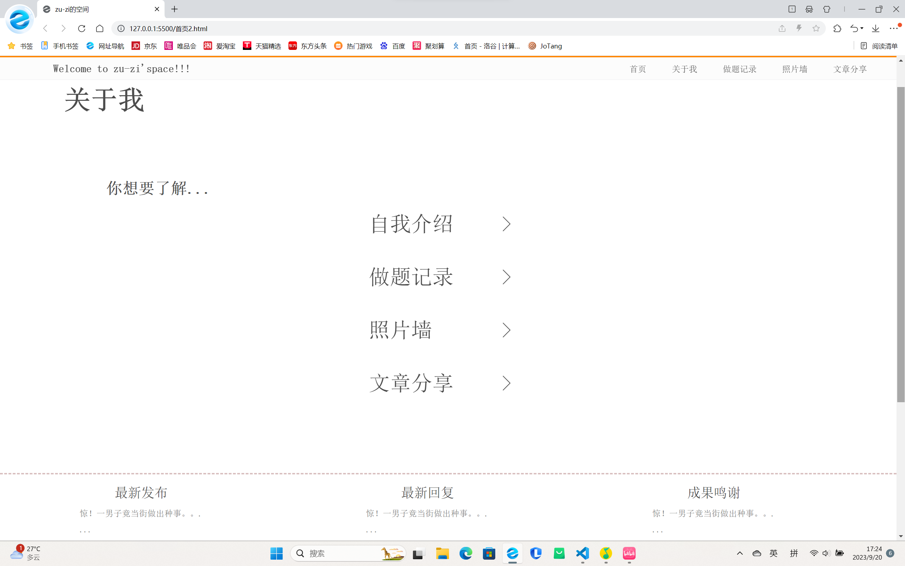

被丑哭了哩/(ㄒoㄒ)/~~

### 9月18日 ###
+ 去参观啦，耶耶✌ 
+ 听了学长的讲解，学到了很多哩
  
### 9月19日 ###
+ 今天晚上没有去吃饭，上完最后一节课直接去了晚自习教室，肝了三个小时，它变成了这样：
  
 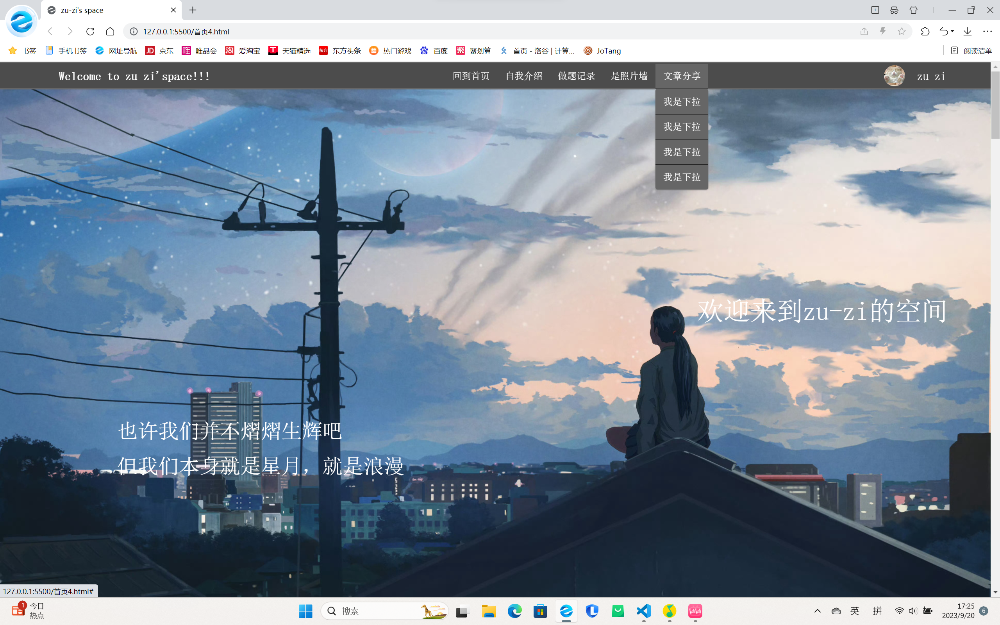

  （这个是19日做的，但是忘记截图了，这张图是20日截的）
+ 对此，我的评价是：虽然技术含量不高，但是还挺好看的，嘿嘿
  
### 9月20日 ###
+ 今天看网课，老师说CSS基础差不多已经学完啦，剩下的课程是移动端web的教程，我想了想，决定先不学这个，先学学javascript,我真的好奇那个轮播图是怎么做出来的很久了┭┮﹏┭┮

### 9月20-9月26日 ###
+ 学了一个暑假的C++，再来学习JS，有些得心应手，感觉不同语言的本质都是一样的，相较起来，JS可能会简单一些，感觉它声明新量时对于数据类型的要求确实不高，原本计划剩余招新时间都来学的JS基础，6天就学完了。
+ 我现在又有了新的目标，我想要在招新时间内学到Vue,尽量完成任务2。
  

+ 为此，我会不断努力。

### 9月27-10月5日###
+ 开始学API啦，感觉好多曾经觉得很神奇的效果不断地被实现出来，好有成就感！！
  
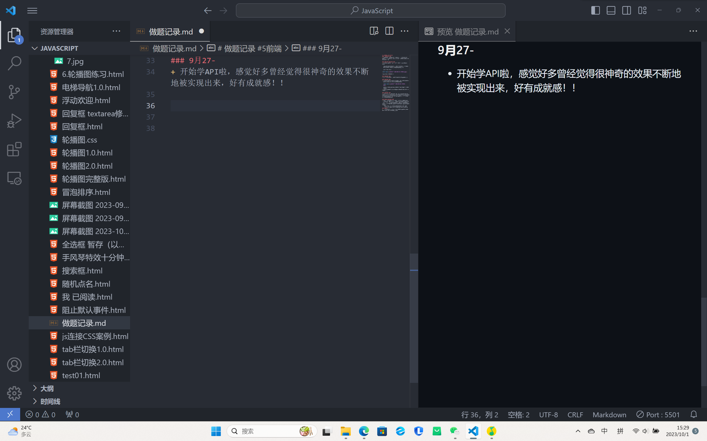

如上图左侧，是我学到10月1日左右实现过的效果，我打算最后用这些元素来共同构思搭建我的blog。
+ 感觉学习JS最重要的是理解***对象***
+ ***事件***真的解决了我很多疑惑，例如：
   + web是怎么知道我发布评论时按的是'Enter'，而不是任意键
   + 买东西时，悬停鼠标进行放大商品局部的效果是怎样获取鼠标位置的

### 10月3日 ###
+ 今天学了一天的Js,做案例做的头晕眼花的，终于学到了localstorage了，耶耶，现在就可以保存每次的数据了

### 10月4日 ###
+ 悲伤，不知道为什么我的设备不认arr.map(function(ele,index){})这个写法，我以为是我的代码写错了，调试了一下午，呜呜呜呜，最后一步步排查才发现这样得到的新数组元素全是undefined.
  
### 10月5日 ###
+ 今天开始正式写我的blog啦，第一天就从17：00熬到了2：00，才写了整个注册页和登录页的一点点，~~呜呜~~身体很疲惫，但是很高兴啦，成就感满满。
  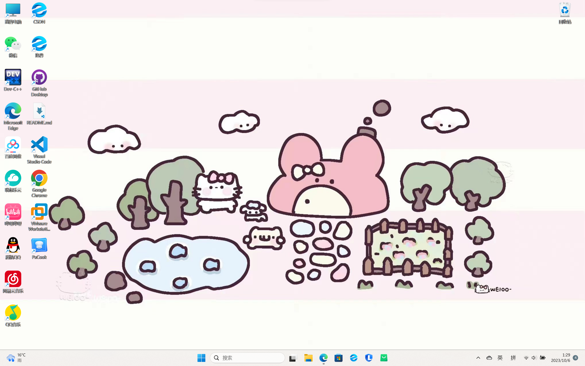
### 10月6日 ###
+ 今天写到首页捏，但是只写出了个框架
+ 不想开学，不想开学，不想开学*(n+1)
  
### 10月7日-10月11日 ###
+ 连续5天泡图书馆从下午的课上完到闭馆（严谨的说，好像前两天没有到闭馆，记不到了，摸头）~~这就是不天天记录导致的~~
  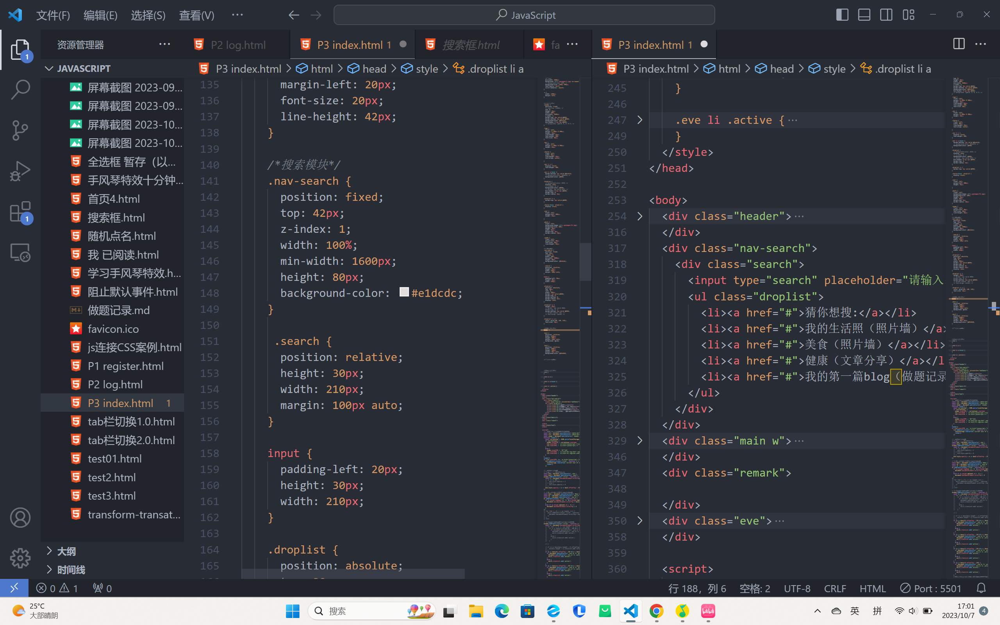
  
  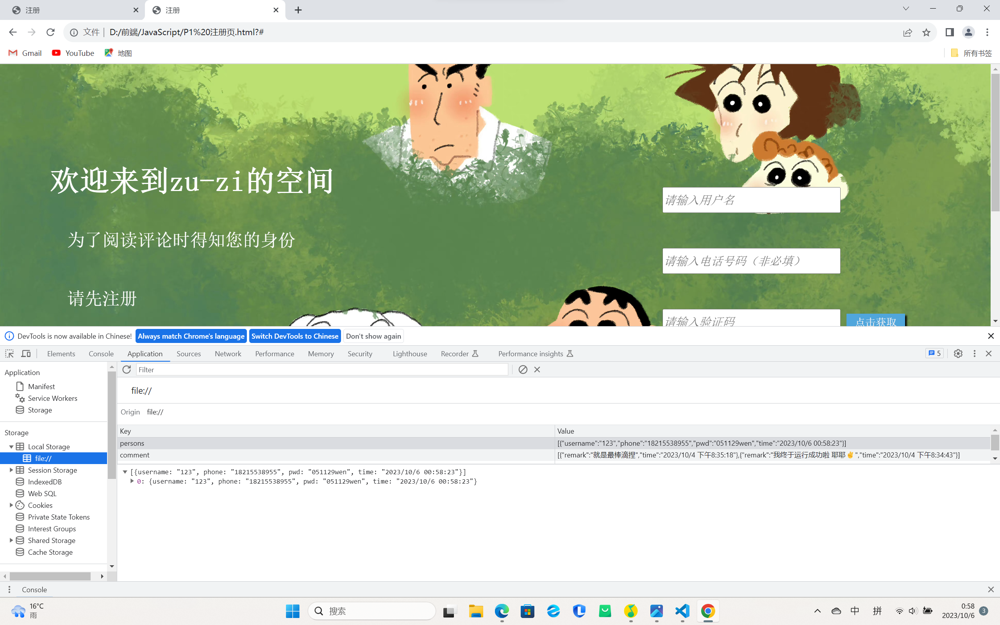
+ 我终于看到胜利的曙光了
  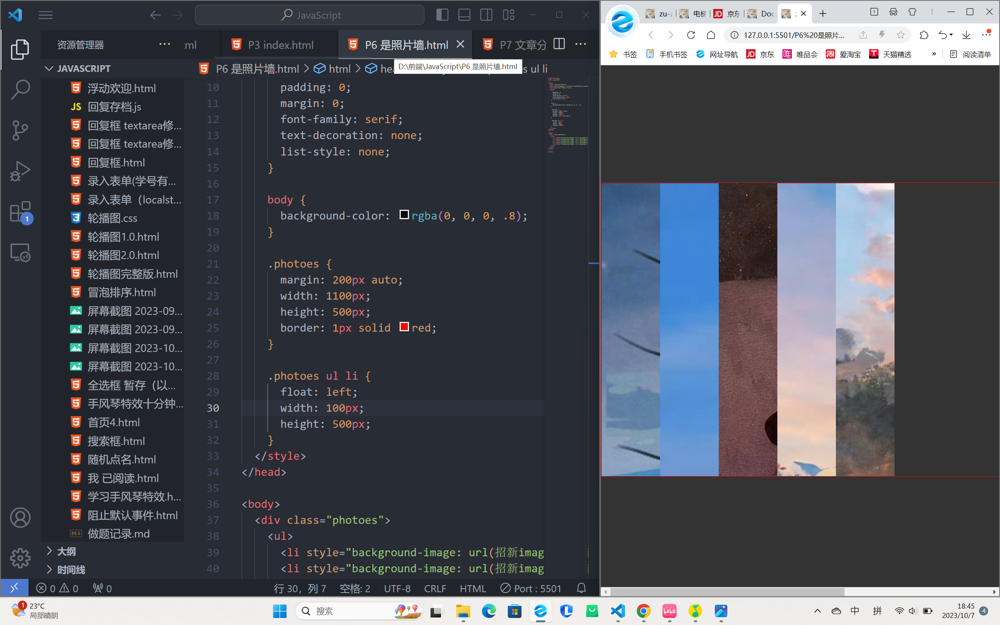
+ 10月7日有在计划把blog写完之后的安排，跃跃欲试地想完成任务二，就抽空看了看Vue,但是看不懂😔，有好多专业名词我完全看不懂捏😔，激动的心猛地被凉水浇灭了，还是得慢慢来啊
+ 对了，10月8日看到有同学在群里问netlify部署的事，我最开始还以为是前端题嘞，但后来又仔细看了看，好像是后端题吗？感觉好有趣，学会了就可以弥补我这个blog只能本地，不能共享回复的遗憾。
+ 虽然但是，我决定另起计划：
    + 1、尝试用原生js写任务二，能完成多少是多少吧
    + 2、努力学学后端，完善完善我的blog
+ 但是这一切的一切都得等我先踏踏实实地写完任务一再说捏
  
### 10月12日 ###
我终于写完任务一啦，但是只是基本框架，还有很多细节的地方没有处理。在此之前，我想先休息休息，真的熬不住这种强度了

### 10月13日-10月17日###
+ 我决定尽量先完成任务二，再谈了解后端交互的事，于是我开始写任务二啦
+ 做这种有现成网站的复刻，不需要自己思索怎样写更美观，只用思考如何实现相应效果，真是太幸福哩！我每次写,CSS花的时间是最多的，呜呜呜
+ 形如b站这样的网站，渲染数据好方便啊，之前都没有这么直观的体会到js处理数据的强大之处
  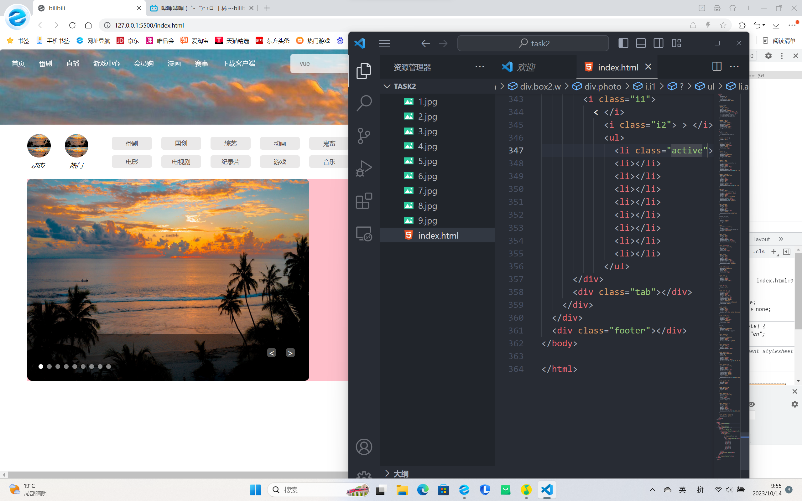
 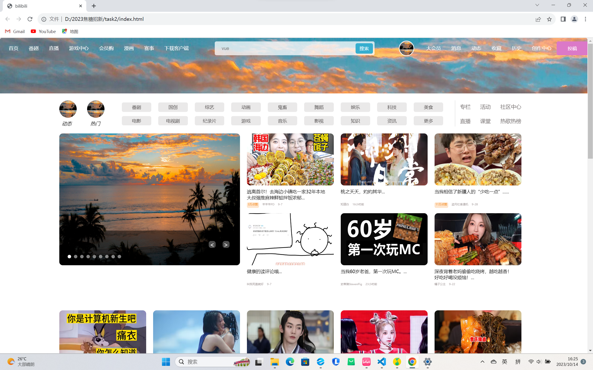
 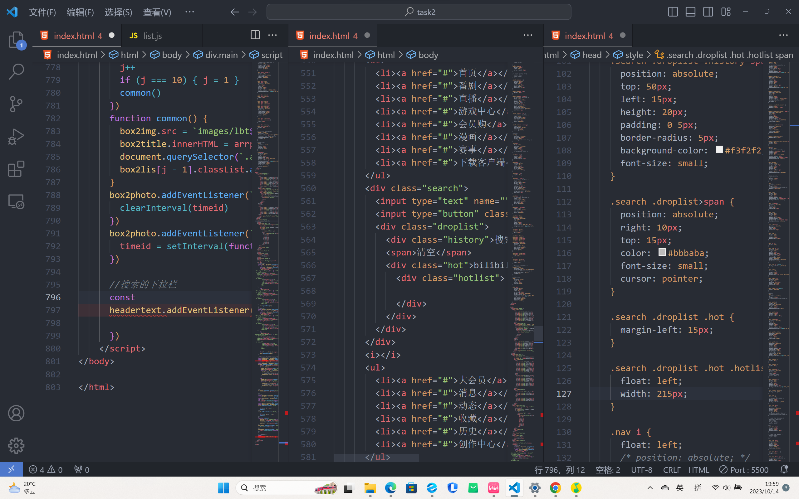
 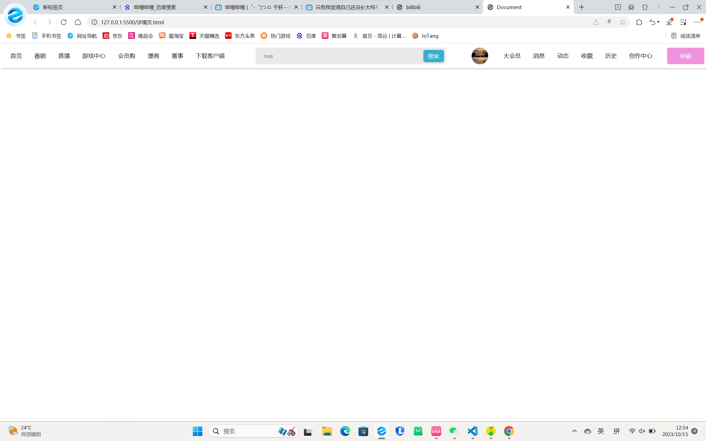
+ 关于视频的兼容性问题真的是
+ 我会做弹幕了，好神奇！！！
  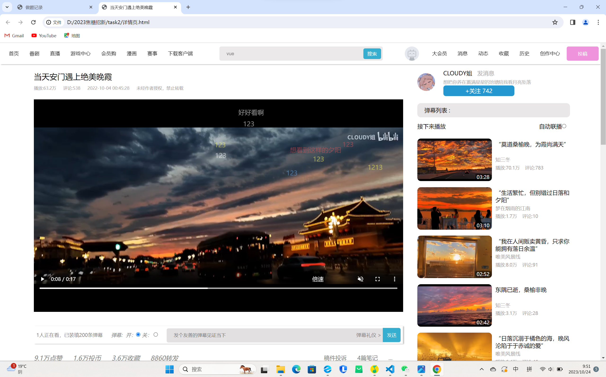
+ 17日，今天写完了，我决定先不忙着提交，尝试完成更高的要求
  
### 10月18日 ###
+ 今天完善了两份部署的markdown,以及做题记录（即该文件），和总的学习记录（包含其它选题的md）并将文件重新整理分
类，已经是可以提交的状态啦

### 10月19日 ###
+ 开始完成进阶要求啦。通过搜索了解每个要求的意思，我首先将目光聚焦于AJAX的学习
+ 在学习的途中，我发现有许多关于服务器，node.js的内容我并不太能理解的了，每次讲到前端AJAX发送异步请求时就松了一口气
+ 今天把AJAX囫囵吞枣地过了一遍，还算熟练了AJAX的代码，也对这个大的交互框架有了更深的理解
  
### 10月20日-10月22日 ###
+ 将blog布置到github pages啦，但是感觉公网访问的话这个速度确实...
  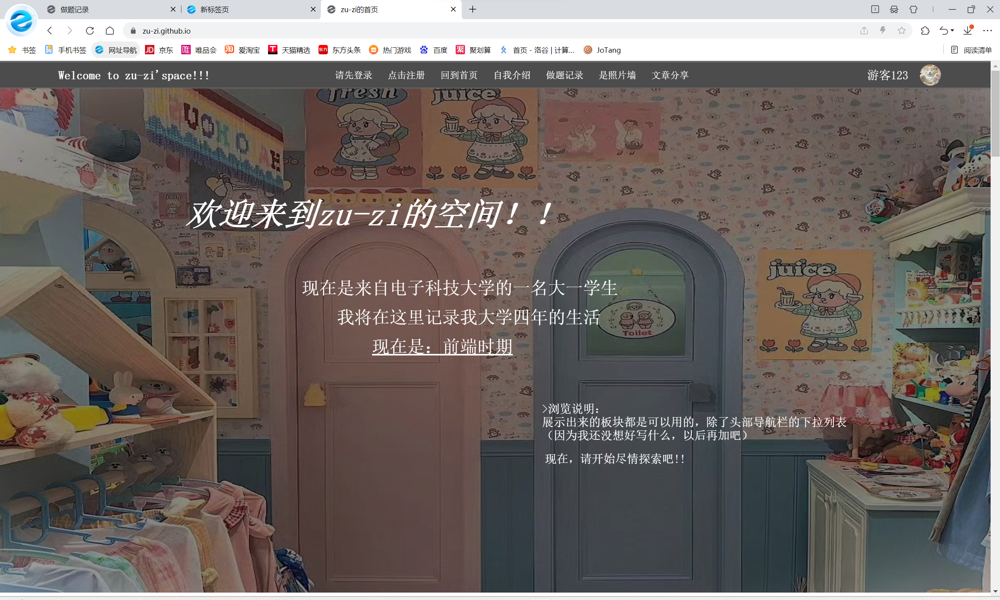
+ 然后不知道为什么我登陆netlify一直有问题
   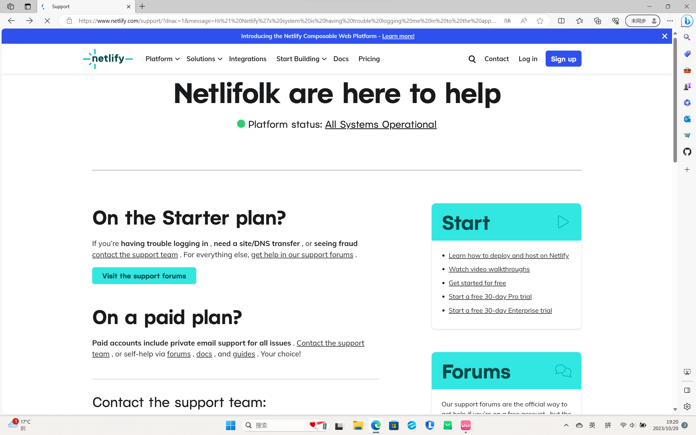
+ 开始学习node.js!
+ 其实之前为能更了解浏览器运行机制（~~满足好奇心~~）有陆陆续续地在学
+ 这一条为提交时补充：已学fs,https,express..
  
  
### 10月23日 ###
+ 今天原本是打算提交的，但是22日晚上临交之前突然被我的blog丑到了，辗转一宿，还是决定大改
+ 它原来丑成这个样子：
  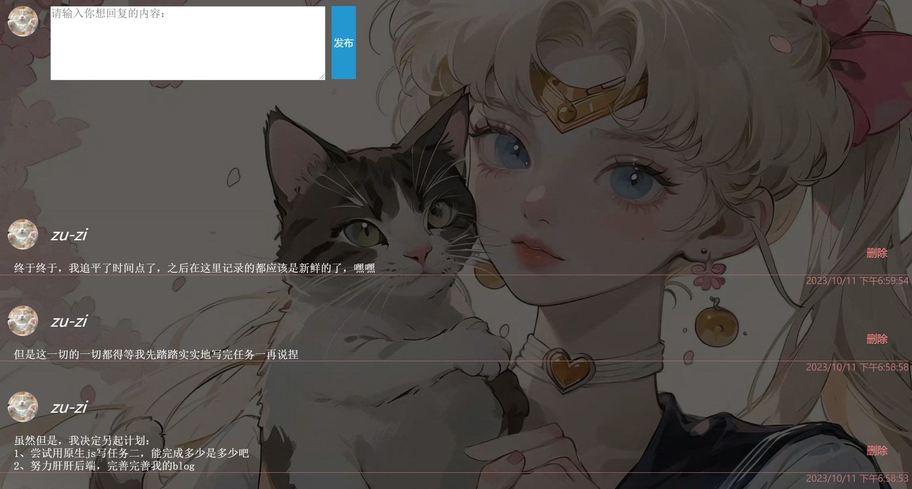
  
+ 下午一下课就冲到图书馆，我把index.html推翻重写了，还把其他页都改了很多
+ 在连肝7个小时后，它成了现在这个样子
+ 幸好，幸好，还来得及，明天再来重写部署吧
  
  ### 10月24日 ###
  + 最后一天，当我写下这段文字时，正在最后调试，重新部署到git上，还有md文件的完善...
  + 请原谅我的踩点交，毕竟当初我只是个想要通过学习node.js来让留言区不只局限于个人的单纯小女孩，~~虽然最后也没能学到数据库来实现这个功能~~